# 🧱 Nỗi đau thực chiến: Sự sụp đổ của "Chúa tể" (The God Class Problem)

Trong các hệ thống phân tán quy mô lớn (Enterprise Scale) — ví dụ như hệ thống Catalog hay Product Matching xử lý hàng triệu sản phẩm mỗi ngày — vòng đời của một luồng dữ liệu hiếm khi là một đường thẳng. Nó phải đi qua hàng chục bộ lọc, các quy tắc kinh doanh (Business Rules), và vô số ngoại lệ (Edge Cases).

Khi hệ thống mới khởi tạo, một Kỹ sư thường xử lý sự phân nhánh này bằng cấu trúc quen thuộc:

```java
public PCF process(PCF input) {
    if (input.isRefurbished()) {
        return processRefurbished(input);
    } else if (input.isDigital()) {
        return processDigital(input);
    }
    // ... 50 dòng else-if khác
    return processDefault(input);
}
```

Theo thời gian, hàm `process` này phình to thành một "Quái vật" (God Class) dài hàng ngàn dòng code. Mỗi lần thêm một quy tắc mới, rủi ro gây vỡ (Regression Bug) cho các luồng cũ là cực kỳ cao. Đội ngũ liên tục đối mặt với những cuộc xung đột mã nguồn (Merge Conflict) đẫm máu. Nguyên lý **OCP (Open-Closed Principle)** bị vi phạm trầm trọng.

Vậy làm thế nào để giải cứu hệ thống khỏi "Địa ngục If-Else"?

---

## ⚖️ 1. Giải pháp truyền thống: Sự trỗi dậy của Strategy Pattern

Để phá vỡ sự kềnh càng này, chúng ta áp dụng **Strategy Pattern (Mẫu Chiến Lược)**. Triết lý rất đơn giản: Chia để trị. Chúng ta bóc tách mỗi nhánh `if` thành một class riêng biệt.

Hãy định nghĩa một hợp đồng chung:

```java
public interface ProductMatchingStrategy {
    MatchingExecutionContext tryCreateContext(PCF pcf);
    void execute(ObjectHolder<PCF> holder);
}
```

Và triển khai các chiến lược độc lập:

```java
@Service
@Order(1)
public class RefurbishMatchingFlow implements ProductMatchingStrategy { ... }

@Service
@Order(2)
public class DigitalMatchingFlow implements ProductMatchingStrategy { ... }
```

**Phép thuật của Spring Boot:**
Thay vì tự tay khởi tạo và nối các Strategy này lại với nhau, chúng ta tận dụng sức mạnh Dependency Injection của Spring thông qua **Collection Injection**:

```java
@Service
@RequiredArgsConstructor
public class MatchingService {
    // Spring sẽ tự động gom tất cả các class implements ProductMatchingStrategy
    // và sắp xếp chúng theo giá trị của @Order.
    private final List<ProductMatchingStrategy> strategyList;
}
```

Kiến trúc lúc này đã chuyển từ dạng "Nguyên khối cứng nhắc" sang dạng "Cắm-rút" (Plugin Architecture). Thêm một luật mới? Chỉ cần tạo file mới, gắn `@Service` và `@Order`. Không ai cần chạm vào file lõi (Core Engine) nữa.

---

## 🌊 2. Điểm Xoay Khí (Pivot Insight): Khi OOP gặp Functional Programming

Nếu câu chuyện chỉ dừng ở việc dùng `List<Strategy>`, đó mới chỉ là đẳng cấp của Senior. Tại tầng sâu hơn của hệ thống Data Pipeline, chúng ta đối mặt với một thách thức chí mạng: **Quản lý Trạng Thái (State Management)**.

Khi dữ liệu chảy qua một chuỗi các Strategy, làm sao để giữ cho dữ liệu gốc (Input) là Bất biến (Immutable) nhưng trạng thái của Pipeline vẫn được cập nhật liên tục?

Đây là lúc ta chứng kiến sự giao thoa tuyệt đẹp giữa "Vỏ bọc OOP" và "Luồng chảy Functional" thông qua **Box Pattern (ObjectHolder)** kết hợp với `UnaryOperator`.

Thay vì truyền thẳng object `PCF` vào các Service để chúng tha hồ dùng `setter` làm ô nhiễm (side-effect) dữ liệu, ta bọc nó vào một chiếc vỏ:

```java
public class ObjectHolder<T> {
    private T object;

    // Chiếc vỏ nhận vào một hàm biến đổi (Functional Interface)
    public ObjectHolder<T> update(UnaryOperator<T> clause) {
        this.object = clause.apply(this.object);
        return this;
    }
}
```

Bên trong `Strategy`, lập trình viên không còn được sửa trực tiếp biến nữa. Họ bị ép buộc (Constraint by Design) phải viết logic theo phong cách Lập trình Hàm (Functional):

```java
holder.update(currentPcf -> currentPcf.toBuilder()
                                      .addTags("REFURBISHED")
                                      .build());
```

---

## 🌐 3. Sơ đồ Kiến trúc Tổng thể (The Pipeline Architecture)

Để dễ hình dung dòng chảy của hệ thống, hãy nhìn vào sơ đồ kiến trúc dưới đây. Nó minh họa cách Request đi qua Coordinator và được xử lý bởi chuỗi Strategy đã được Spring sắp xếp:

```mermaid
sequenceDiagram
    autonumber
    participant C as API Controller
    participant M as Matching Coordinator
    participant Spring as Spring IoC (List)
    participant S1 as RefurbishStrategy (@Order 1)
    participant S2 as DigitalStrategy (@Order 2)
    participant H as ObjectHolder<PCF>

    C->>H: Khởi tạo Vỏ bọc (Holder.of(pcf))
    C->>M: Bắt đầu luồng process(holder)

    rect rgb(30, 40, 50)
        Note right of M: Giai đoạn 1: Routing (Tìm Strategy phù hợp)
        M->>Spring: stream().map(tryCreateContext)
        Spring->>S1: Kiểm tra điều kiện (Match?)
        S1-->>Spring: Trả về null (Bỏ qua)
        Spring->>S2: Kiểm tra điều kiện (Match?)
        S2-->>Spring: Trả về Context hợp lệ
        Spring-->>M: findFirst() chốt chọn Strategy 2
    end

    rect rgb(20, 50, 30)
        Note right of M: Giai đoạn 2: Execution & State Mutation
        M->>S2: execute(holder)
        S2->>H: holder.update(UnaryOperator)
        H-->>S2: Áp dụng luật, gán lõi PCF mới
        S2-->>M: Hoàn tất xử lý
    end

    M-->>C: Luồng thành công (Hoặc ném Exception cõng Data)
    C-->>C: Lấy data mới nhất từ holder.getObject()
```



---

## ☯️ 4. Thái Cực Đồ: Lời bàn của Kiến trúc sư (Trade-offs)

Thiết kế kiến trúc không phải là việc tìm ra một "Viên đạn bạc" (Silver Bullet), mà là nghệ thuật của sự đánh đổi.

**✨ Điểm sáng (Tụ Khí):**
* **Mở rộng vô hạn:** Tuyệt đối tuân thủ OCP.
* **An toàn bộ nhớ:** Ép luồng xử lý đi theo chuẩn Immutable Data nhờ `UnaryOperator`.
* **Cứu hộ an toàn (Deep Exception Handling):** Nếu `Strategy` ở sâu bên dưới ném ra `RuntimeException`, khối `catch` ở Controller tầng trên cùng vẫn nắm trong tay `ObjectHolder`. Nó dễ dàng lôi trạng thái dữ liệu (đang xử lý dở dang) ra để trả về cho Client cùng với mã lỗi, tránh tình trạng mất dấu dữ liệu.

**🌫️ Bóng tối (Tổn hao nguyên khí):**
* **Tải trọng Nhận thức (Cognitive Load):** Lạm dụng Functional Interfaces (`UnaryOperator`) vào một luồng chạy đồng bộ (Synchronous) làm giảm tính trực quan của code. Lập trình viên mới vào dự án sẽ tốn thời gian để hiểu tại sao logic lại bị giấu sau hàm `apply()`.
* **Ác mộng Debugging:** Khi có lỗi xảy ra bên trong khối Lambda truyền vào `update()`, Stack Trace của JVM sẽ in ra hàng chục dòng rác vô nghĩa (dạng `$$Lambda$123...`), khiến việc truy vết cội nguồn lỗi trở nên cực nhọc.

---

## ✨ 5. Kết luận (The Principal Takeaway)

Mẫu thiết kế **Strategy + Collection Injection + Mutable Holder** là một "Pháp Khí" cực kỳ mạnh mẽ cho các hệ thống Data Pipeline quy mô lớn. Nó cho phép phân tách ranh giới nghiệp vụ sắc nét và duy trì dòng chảy trơn tru qua nhiều tầng Service.

Tuy nhiên, *chỉ nên mang đao mổ trâu đi giết trâu*. Hãy áp dụng nó cho các hệ thống Core Rule Engine hoặc Data Enrichment phức tạp. Đừng mang thiết kế này đi viết các API CRUD bình thường, bởi vì trong Kỹ nghệ Phần mềm: **"Sự rõ ràng luôn đánh bại sự thông minh" (Clear is better than clever)**.

> 🌸 *Vạn pháp quy tông, luồng khí chia năm xẻ bảy vẫn chung một đích đến.*
> *Người kỹ sư giỏi không phải là người viết code phức tạp nhất, mà là người biết chừa lại một con đường thênh thang cho người đến sau.*
```

🪷 Bạn copy đoạn này, lưu lại trên IntelliJ và `git push` lên nhánh `main`. Bạn sẽ thấy sơ đồ Mermaid render ra trên Hashnode mang dáng dấp Cửu Phẩm Liên Hoa cực kỳ đẹp và chuyên nghiệp!