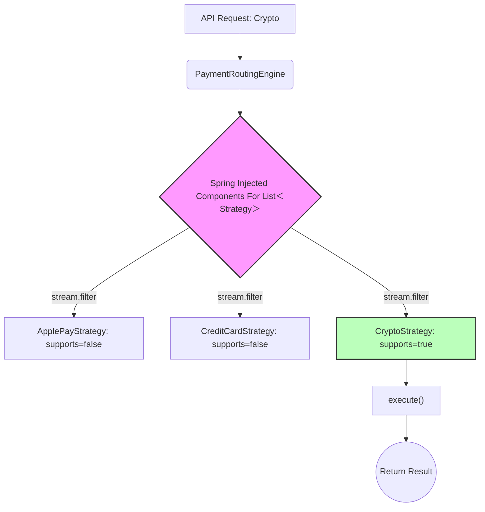

```markdown
---
title: "Routing as a First-Class Problem: From If-Else Chaos to Deterministic Pipelines"
date: 2026-03-27
tags: ["software-architecture", "system-design", "spring-boot", "routing", "backend"]
series: ["Mastering Enterprise Complexity"]
weight: 1
summary: "When systems scale, they don't fail because of incorrect logic; they fail due to a loss of control over execution order. Here is how to build a Deterministic Strategy Pipeline."
draft: false
math: false
mermaid: true
---

# 🪷 Engineering Brick: Routing as a First-Class Problem

> 🌸 *The logic is sound, yet the system breaks,*
> *When a hundred branches dictate the stakes.*
> *Separate the route from the deed to be done,*
> *And the chaotic pipeline aligns into one.*

## 🌠 1. The Formal Specification (Problem Model)

In distributed systems, we frequently encounter the **Signal** of **Dynamic Execution Routing**. A request arrives, and based on its payload, the system must dynamically decide which sequence of business logic to execute.

To ground this abstraction, let’s look at a **Payment Routing Engine**.

**The Workload & Constraints**:
* **Scale**: The system supports 15+ execution paths (Credit Card, PayPal, Crypto, Buy-Now-Pay-Later, etc.).
* **Velocity**: The business demands a new integration every month.
* **Concurrency**: Multiple autonomous squads contribute to this flow simultaneously.
* **The Anti-Pattern**: The routing logic is tightly coupled with the execution logic in a massive 3,000-line `PaymentService` utilizing a sprawling `switch-case` or `if-else` chain.

---

## 🌪️ 2. What Breaks First at Scale (The Failure Mode)

Before designing the solution, we must understand the pathology of the failure. At ~10+ execution branches, a hardcoded routing system does not fail because the business logic is wrong. **It fails because of the loss of control over execution order.**

When multiple teams append logic to a central `if-else` block:
1. **Implicit Ordering**: The order of `if` statements becomes a fragile, undocumented dependency. If Team A puts their condition above Team B's, they might accidentally swallow Team B's traffic.
2. **Global Blindness**: Developers stop understanding the end-to-end flow. The cognitive load required to trace a request through a 3,000-line file causes severe hesitation and slows down deployment velocity.
3. **Merge Conflict Hell**: A single file becomes the bottleneck for the entire organization's release cycle.

---

## 🧩 3. The Architecture: Deterministic Strategy Pipeline

We must treat **Routing** as a first-class problem, completely separated from **Execution**. We achieve this by building an **Execution Routing Layer** leveraging Inversion of Control (IoC), specifically utilizing Spring Boot's Collection Injection.

### Step 1: The Contract (Invariant)
We define a strict boundary. Every plugin must answer two distinct questions: *Should I execute?* and *How do I execute?*

```java
public interface ExecutionPlugin<C, R> {
    // The Sensor: Evaluates the routing condition dynamically
    boolean supports(C context);

    // The Executor: Contains the actual business logic
    R execute(C context);
}
```

### Step 2: The Distributed Plugins
Teams can now build their logic in complete isolation. They own their domain packages and do not need to touch the core routing engine.

Notice the `@Order` annotation: This explicitly ranks the plugin, guaranteeing deterministic execution if multiple plugins ever overlap.

```java
@Component
@Order(10) // 💠 The shield against Execution Order Ambiguity
public class CryptoPaymentPlugin implements ExecutionPlugin<PaymentContext, PaymentResult> {

    @Override
    public boolean supports(PaymentContext ctx) {
        return ctx.getType() == PaymentType.CRYPTO;
    }

    @Override
    public PaymentResult execute(PaymentContext ctx) {
        // ... highly specific domain logic
        return PaymentResult.success();
    }
}
// O(1) time | O(1) space for plugin internal routing
```

### Step 3: The Runtime-Assembled Engine
Instead of manually wiring a Factory or writing complex Reflection logic, we offload the routing aggregation to the framework.

```java
@Service
@RequiredArgsConstructor
public class DynamicRoutingEngine {

    // 💠 THE PIVOT INSIGHT: Spring automatically injects all active plugins
    // AND inherently sorts them based on their @Order values.
    private final List<ExecutionPlugin<PaymentContext, PaymentResult>> plugins;

    public PaymentResult process(PaymentContext ctx) {
        return plugins.stream()
                .filter(plugin -> plugin.supports(ctx))
                .findFirst()
                .orElseThrow(() -> new UnroutableException("No plugin found for context"))
                .execute(ctx);
    }
}
// O(N) time | O(1) space - where N is the number of active plugins
```

### The Data Flow Diagram
The architecture shifts from a static, tangled maze to a dynamic, declarative pipeline. *(Note: We use Fullwidth characters `＜` and `＞` in the diagram to ensure perfect rendering without breaking the HTML parser).*



---

## ⚙️ 4. Production Realism & Trade-offs

A Principal Engineer knows that no pattern is a silver bullet. This architecture introduces specific trade-offs that must be mitigated.

### 🌑 Trap 1: Execution Order Ambiguity (Overlapping Conditions)
* **The Danger**: If two plugins return `true` for `supports()`, `.findFirst()` will silently pick whichever bean the framework loaded first. This is a catastrophic silent bug.
* **The Mitigation**: You must enforce strict mutually exclusive conditions in the `supports()` method. As shown in the code, utilize `@Order` to explicitly rank the plugins, removing non-deterministic framework loading behaviors.

### 🌑 Trap 2: Invisible Routing (Global Blindness)
* **The Danger**: Because the routing is now dynamic and scattered across the codebase, a new engineer cannot simply `Ctrl+F` to see all available routes.
* **The Mitigation**: Expose the pipeline state. Hook into the `@PostConstruct` lifecycle to log the exact list and order of loaded plugins, or expose an actuator endpoint that prints the active routing table.

---

## 🌐 5. Generalization: This Is Not About Payment

The true power of this architecture is its universality. We did not just build a payment system; we abstracted a **Runtime-assembled Decision Engine**.

This exact pattern applies to any system where logic branches dynamically, behavior evolves rapidly, and multiple teams contribute independently:
* **Order Matching Engines**: Routing orders to different liquidity pools based on instrument types.
* **Recommendation Pipelines**: Selecting the correct AI inference model based on user tier and geographic region.
* **Fraud Detection Systems**: Applying different risk-scoring rules dynamically.
* **ETL Data Processing**: Routing unstructured data to appropriate normalization parsers.

---

*One sentence to trigger the reflex:* **"Do not hardcode your decisions; assemble your routing logic dynamically at runtime to let the system scale beyond human cognitive limits."**

> **Next up**: In Part 2, as our pipeline grows from 10 plugins to 50, even this architecture will begin to fracture under the weight of side-effects. We will explore **Orthogonal Architecture** and learn how to decouple core execution from cross-cutting extensions.
```