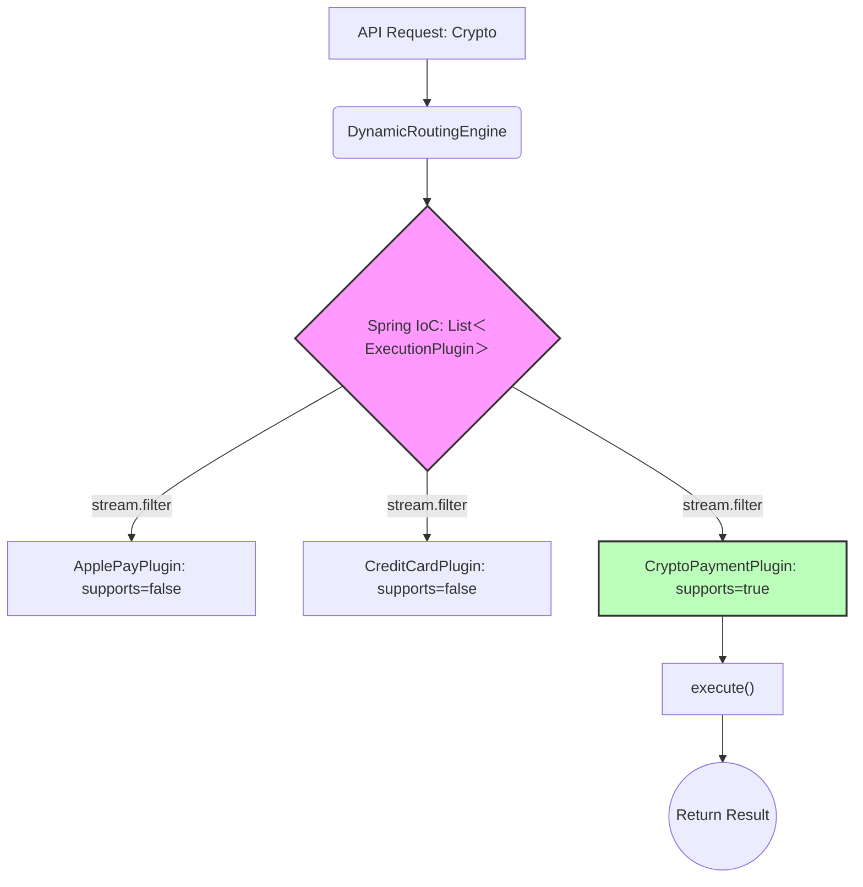

# 🪷 Engineering Brick: Routing as a First-Class Problem

> 🌸 *The logic is sound, yet the system breaks,*
> *When a hundred branches dictate the stakes.*
> *Separate the route from the deed to be done,*
> *And the chaotic pipeline aligns into one.*

## 🌠 1. The Formal Specification (Problem Model)

In distributed systems, we frequently encounter the problem of **Dynamic Execution Routing**. A request arrives, and based on its payload, the system must dynamically decide which sequence of business logic to execute.

To ground this abstraction, let’s look at a **Payment Routing Engine**. 

**The Workload & Constraints**:
* **Scale**: The system supports 15+ execution paths (Credit Card, PayPal, Crypto, Buy-Now-Pay-Later, etc.).
* **Velocity**: The business demands a new integration every month.
* **Concurrency**: Multiple autonomous squads contribute to this flow simultaneously.
* **The Anti-Pattern**: The routing logic is tightly coupled with the execution logic in a massive 3,000-line `PaymentService` utilizing a sprawling `switch-case` or `if-else` chain.

---

## 🌪️ 2. What Breaks First at Scale (The Failure Mode)

Before designing the solution, we must understand the pathology of the failure. At ~10+ execution branches, a hardcoded routing system does not fail because the business logic is wrong. **It fails because of the loss of control over execution order.**

When multiple teams append logic to a central `if-else` block:
1. **Implicit Ordering**: The order of `if` statements becomes a fragile, undocumented dependency. If Team A puts their condition above Team B's, they might accidentally swallow Team B's traffic.
2. **Global Blindness**: Developers stop understanding the end-to-end flow. The cognitive load required to trace a request through a 3,000-line file causes severe hesitation and slows down deployment velocity.
3. **Merge Conflict Hell**: A single file becomes the bottleneck for the entire organization's release cycle.

---

## 🧩 3. The Architecture: Deterministic Strategy Pipeline

We must treat **Routing** as a first-class problem, completely separated from **Execution**. We achieve this by building an **Execution Routing Layer** leveraging framework-assembled composition via IoC.

### 3.1 The Routing Correctness Contract (Invariant)
Before writing code, we must define what "correctness" means. A routing system is only correct if it satisfies exactly one of the following outcomes:
1. **Exactly one plugin matches** $\rightarrow$ execution proceeds.
2. **No plugin matches** $\rightarrow$ request is explicitly rejected.
3. **Multiple plugins match** $\rightarrow$ system fails fast with a routing ambiguity error.

*Anything else is not a business edge case—it is a correctness failure.*

### 3.2 The Code Skeleton
We establish the boundary and let the framework (Spring Boot) assemble the engine dynamically. Notice how the engine explicitly enforces the Correctness Contract rather than hoping for the best.

```java
// 1. The Contract
public interface ExecutionPlugin<C, R> {
    boolean supports(C context); // The Sensor
    R execute(C context);        // The Executor
}

// 2. The Isolated Plugin
@Component
public class CryptoPaymentPlugin implements ExecutionPlugin<PaymentContext, PaymentResult> {
    @Override
    public boolean supports(PaymentContext ctx) {
        return ctx.getType() == PaymentType.CRYPTO;
    }
    @Override
    public PaymentResult execute(PaymentContext ctx) {
        return PaymentResult.success();
    }
}

// 3. The Runtime-Assembled Engine
@Service
@RequiredArgsConstructor
public class DynamicRoutingEngine {
    
    // 💠 The framework automatically injects all active plugins
    private final List<ExecutionPlugin<PaymentContext, PaymentResult>> plugins;

    public PaymentResult process(PaymentContext ctx) {
        List<ExecutionPlugin<PaymentContext, PaymentResult>> matches = plugins.stream()
                .filter(plugin -> plugin.supports(ctx))
                .toList();

        if (matches.isEmpty()) {
            throw new UnroutableException("No plugin found. Explicitly rejected.");
        }
        
        // 💠 Enforcing fail-fast ambiguity detection
        if (matches.size() > 1) {
            throw new RoutingAmbiguityException(matches); 
        }

        return matches.get(0).execute(ctx);
    }
}
```

### 3.3 Why Not a Factory or Map-Based Routing?
A Senior Engineer builds a solution; a Principal Engineer defends the design space:
* **Why not a Factory Pattern?** It centralizes logic. Teams still fight over modifying the `Factory` class, violating OCP.
* **Why not an Enum Map?** Map routing becomes rigid and makes dynamic condition evaluation (e.g., checking user tiers + payment type) incredibly difficult.
* **Why not a Reflection-based Registry?** It adds severe startup complexity without safe lifecycle control.
👉 *IoC-based assembly wins because it shifts the assembly responsibility to the framework while preserving 100% extensibility.*

### 3.4 The Data Flow Diagram
*(Note: We use Fullwidth characters `＜` and `＞` in the diagram to ensure perfect rendering).*



---

## ⚙️ 4. Production Realism & Trade-offs

### ⚠️ Trap 1: Determinism Is Not Free
Utilizing `.findFirst()` combined with `@Order` creates ordered routing, **not true determinism**. 
Determinism only exists if the system enforces one of these governance models:
* Mutually exclusive predicates (mathematically impossible for two plugins to return true).
* Centralized routing registry.
* Fail-fast ambiguity detection (throwing an exception if `.filter().count() > 1` as implemented above).

*Without strict governance, the system silently degrades into non-deterministic behavior.*

### 📊 Trap 2: Operational Visibility (Non-negotiable)
A routing system must be strictly observable. Without observability, routing becomes invisible—and invisible systems are un-debuggable systems. The pipeline must expose:
1. Total number of active plugins loaded at startup.
2. Routing match distribution (Which plugin handles the most traffic?).
3. Unroutable request count (The Drop Rate).
4. Ambiguity detection metrics.

### 🧑‍🤝‍🧑 4.3 Organizational Impact
This architecture is not just a code-level improvement. It fundamentally changes how teams collaborate:
* Each team owns its plugin end-to-end.
* There is no shared modification surface.
* Reduced coordination overhead.
* Safer parallel development.

👉 *At scale, this is not an implementation detail—it is an organizational scaling strategy.*

---

## 🌐 5. Generalization: This Is Not About Payment

The true power of this architecture is its universality. We did not just build a payment system; we abstracted a **Runtime-assembled Decision Engine**. 

This exact pattern applies to any system where logic branches dynamically, behavior evolves rapidly, and multiple teams contribute independently:
* **Order Matching Engines**: Routing orders to different liquidity pools.
* **Recommendation Pipelines**: Selecting AI inference models based on user tier.
* **Fraud Detection Systems**: Applying risk-scoring rules dynamically.
* **ETL Data Processing**: Routing unstructured data to appropriate parsers.

---
