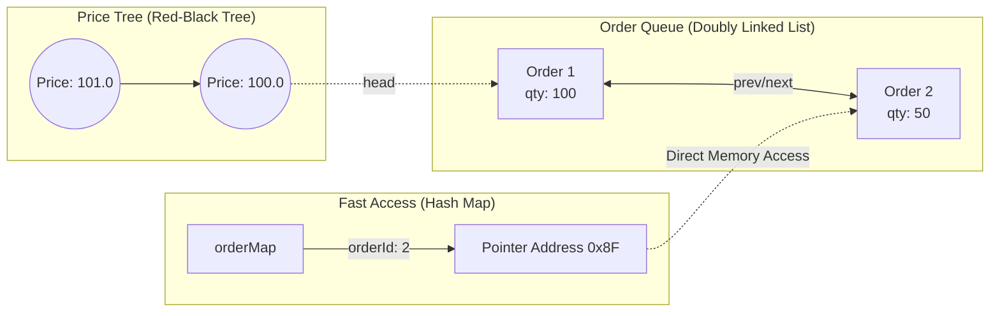

# 🧱 Engineering Brick: The Microsecond Order Book

> 🌸 *In the realm where microseconds define the king,*
> *The Tree holds the price, the List rules the ring.*

## 🌠 1. The Formal Specification (Problem Model)
Before designing any data structure, we must formalize the workload. We are building the core Matching Engine for a high-frequency trading (HFT) exchange.

**The Interface (Core Operations)**:
* `addOrder(orderId, side, price, qty)`: Insert a new order.
* `cancelOrder(orderId)`: Remove an existing order.
* `match()`: Execute trades when market conditions are met.

**The Workload & Constraints (Real-world Scale)**:
* **Scale**: A typical liquid symbol (e.g., AAPL) has ~10,000 active price levels and 1,000,000+ resting orders.
* **Throughput**: 100,000+ orders per second per symbol.
* **Workload Skew**: Extremely cancellation-heavy. Up to 90% of orders are cancelled before execution.
* **Latency Target**: $<100 \mu s$ end-to-end processing.
* **Architecture**: Strictly Single-threaded (zero lock contention, zero context switching).

The challenge: Design a structure that maintains **strict price-time priority** while supporting **$O(1)$** cancellations across a million active nodes.

---

## ⚡ 2. The Design Dialogue (Socratic Review)

*In this section, I simulate a design review discussion to explore trade-offs between a Senior Engineer (The Challenger) and the System Architect.*

> **🕵️ The Challenger**: Let's start with a naive approach. Why not use a sorted array or a simple list? It is highly cache-friendly.

**🧑‍💻 The Architect**:
Arrays fail under our specific workload: the **Cancel/Churn rate**. 
If a trader cancels an order in the middle of the array, we must shift all subsequent elements to fill the gap. That is an **$O(N)$** memory shift. At 100k TPS, $O(N)$ shifts will destroy our latency budget. 

> **🕵️ The Challenger**: If we optimize for cancellation, why not a `HashMap`? It gives us **$O(1)$** access and deletion.

**🧑‍💻 The Architect**:
A HashMap guarantees $O(1)$ for *specific* lookups, but it destroys **Order**. To execute a trade, the engine must instantly find the **Highest Bid** and **Lowest Ask**. Searching an unsorted HashMap for the Min/Max requires scanning all keys, yielding **$O(N)$**. Prices must remain strictly sorted.

> **🕵️ The Challenger**: Sorted and fast... A Balanced Binary Search Tree (Red-Black Tree) then. **$O(\log N)$** for search, insert, and delete. 

**🧑‍💻 The Architect**:
A Tree is perfect for managing *Price Levels*. But a Tree node represents a Price, not a single Order. What happens when 500 traders place an order at exactly $150.00? We need a secondary structure inside the Tree Node to hold those 500 orders while strictly respecting FIFO (First-In-First-Out).

> **🕵️ The Challenger**: We can nest a Queue or a Singly Linked List inside the Tree Node?

**🧑‍💻 The Architect**:
Close, but a Singly Linked List won't work for cancellations. To remove an order from the middle of a list in $O(1)$, we must instantly link its predecessor to its successor. That requires a `prev` pointer. We must use a **Doubly Linked List**.

---

## 🧩 3. The Architecture & Memory Layout
To achieve our goals, we compose three data structures into a Hybrid Model. I use C++ pseudo-code to illustrate the memory layout, as deterministic memory control is mandatory for HFT.

```cpp
// 1. The Queue Element
struct OrderNode {
    string orderId;
    int qty;
    OrderNode* prev; // Mandatory for O(1) unlink
    OrderNode* next; 
};

// 2. The Price Level (Tree Node Value)
struct PriceLevel {
    double price;
    OrderNode* head; // Oldest order (FIFO match)
    OrderNode* tail; // Newest order (Append here)
};

// 3. The Engine State
class OrderBook {
    // Tree: Maintains sorted prices. O(log N) lookup.
    std::map<double, PriceLevel> priceTree; 
    
    // Hash Map: Maps ID to exact memory address. O(1) lookup.
    std::unordered_map<string, OrderNode*> orderMap; 

    // Note on Ownership: 
    // OrderBook owns all OrderNode memory via a custom ArenaAllocator.
    // Pointers in orderMap are guaranteed valid until explicitly freed back to the pool.
};

```

### The Memory Layout Diagram

The magic happens because the HashMap holds a direct **Pointer** to the element inside the Linked List.



---

## 🔄 4. Lifecycle Walkthrough (State Trace)
Let's trace the memory state dynamically to prove the $O(1)$ cancellation.

**T0: User A adds BUY 100 @ $10.0**
* `priceTree` inserts node `10.0`.
* `PriceLevel(10.0)` creates `OrderNode(A)`.
* `orderMap` stores `{"A" -> &OrderNode(A)}`.

**T1: User B adds BUY 50 @ $10.0**
* `priceTree` finds node `10.0` in $O(\log N)$.
* `PriceLevel(10.0)` appends `OrderNode(B)` to the tail in $O(1)$.
* `orderMap` stores `{"B" -> &OrderNode(B)}`.

**T2: User A cancels Order A**
1. Engine looks up `orderMap["A"]`. Result: Memory Address `0xA1` ($O(1)$).
2. Engine jumps directly to `0xA1` in memory.
3. Engine unlinks `OrderNode(A)` from the Doubly Linked List by updating the `prev` and `next` pointers ($O(1)$).
* **Result**: We removed an order from the middle of the book instantly, without traversing the Tree or searching the List.

---

## 📊 5. Complexity Matrix
By decoupling "Search" (Tree) from "Access" (Map), we achieve the optimal theoretical bounds for an Order Book:

| Operation | Time Complexity | Real-world Bottleneck |
| :--- | :--- | :--- |
| `addOrder()` | $O(\log N)$ | Tree rebalancing & Cache misses |
| `cancelOrder()` | $O(1)$ | Map hashing & Pointer dereference |
| `match()` | $O(1)$ | Dequeueing from the `head` of the list |
| `findBestBid()` | $O(1)$ | Cached pointer to the right-most tree node |

---

## ⚙️ 6. Production Realism

In a real-world production environment, Big-O complexity is just a mathematical illusion. Hardware sympathy dictates actual performance.

### 🛡 Memory Ownership & Arena Allocators

Calling `new` or `delete` during trading hours is a cardinal sin. It fragments memory and causes OS interrupts. Furthermore, dangling pointers in `orderMap` would cause fatal segmentation faults.
**The Fix**: We use an **Arena Allocator (Object Pool)**. We pre-allocate a contiguous block of millions of empty `OrderNode` objects at startup. The `OrderBook` claims ownership of this pool. When an order is cancelled, its pointer is simply pushed back onto an "available list" stack for reuse. Zero allocation = Zero fragmentation.

### 🎯 The Precise Invariant
A system is only as stable as its invariants. The core invariant governing our matching engine state machine is:
* `Best Bid < Best Ask` $\rightarrow$ **State: Stable** (Order rests in the book).
* `Best Bid >= Best Ask` $\rightarrow$ **State: Match Required** (Execution triggered immediately).
---

## 💎 7. Optional Deep Dive: The HFT Extreme (For Practitioners)

*If you are building for NASDAQ or Jane Street, the Hybrid Model above has critical flaws. You must fight physics.*

**1. The 64-Byte Cache Line Alignment**
Modern CPUs fetch memory in 64-byte chunks (Cache Lines). To prevent **False Sharing** and maximize L1/L2 cache hit rates, we must meticulously pad our `OrderNode` to be exactly 64 bytes:

```cpp
struct OrderNodeAligned {
    char orderId[16];  // 16 bytes
    int qty;           // 4 bytes
    OrderNode* prev;   // 8 bytes
    OrderNode* next;   // 8 bytes
    char padding[28];  // Pad to exactly 64 bytes
};

```

**2. The `std::map` Trap & Branch Prediction**

* Node allocations in `std::map` (Red-Black Tree) are scattered across RAM. Traversing them causes constant **Cache Misses**.
* Following `prev/next` pointers in a Linked List prevents the CPU's **Branch Predictor** from speculatively executing instructions, leading to expensive pipeline flushes.
* **The Reality**: If the price bounds are known, HFT systems abandon the Tree entirely and use a **Pre-allocated Flat Array** (`Array[Price * TickSize] -> List`). This trades higher RAM usage for absolute, predictable hardware performance.

---

### 🗝 The "Brick" Summary (Mental Model)

* **🌠 Signal**: High-throughput, cancellation-heavy workload requiring deterministic latency.
* **🧩 Structure**: Red-Black Tree (Price) + Doubly Linked List (Queue) + HashMap (Pointer Access).
* **🏛 Invariant**: `Best Bid < Best Ask` (Stable Market).
* **💠 Pivot Insight**: Decouple "Search" from "Access". Use the Map to bypass the Tree entirely during cancellations.

---

🪷 *One sentence to trigger the reflex*: **"Tree finds the price, List keeps the line, Map kills the order, all in constant time."**

> **Next up**: In [Part 2](/posts/3.stock_exchange_matching_engine), we will breathe life into this static structure by building the **Matching Engine**. We will challenge the myth of multi-threading and explore the **LMAX Disruptor**.
