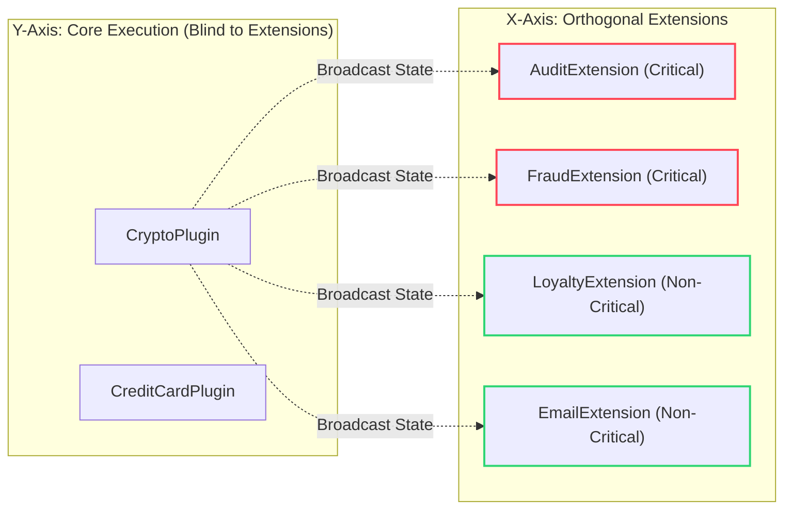

# 🧱 Engineering Brick: Orthogonal Architecture

> 🌸 *Trục dọc kiên định giữ luồng chính,*
> *Trục ngang vạn pháp tựa vệ tinh.*
> *Đóng chặt hạch tâm, mù ngoại cảnh,*
> *Hệ thống phình to vẫn tịnh minh.*

## 🌠 1. The Formal Specification (Problem Model)

In [Part 1](/posts/2.routing_as_first_class_problem.md), we successfully decoupled our payment routing logic into isolated `ExecutionPlugins`. The Core is now clean. However, in an Enterprise environment, executing the core domain is only 20% of the workload.

**The Workload (The Side-Effects)**:
Once `CryptoPaymentPlugin` successfully charges the user, the business requires us to:
1. Send a digital receipt (Email/SMS).
2. Record an immutable Audit Log for compliance.
3. Calculate and award Loyalty Points.
4. Ping the Risk Engine for post-transaction fraud analysis.

**The Constraint**:
Feature teams (Loyalty, Risk, Notifications) demand the ability to add, remove, or modify these post-processing steps without waiting for the Core Payment team's release cycle.

---

## 🌪️ 2. What Breaks First at Scale (The Failure Mode)

The naive approach is to inject `EmailService`, `AuditService`, and `LoyaltyService` directly into the `CryptoPaymentPlugin` and call them sequentially.

When you do this, the system suffers from **Blast Radius Explosion** and **Domain Contamination**.

1. **Catastrophic Blast Radius**: If the external Email API times out and throws an exception, the entire Payment transaction rolls back. *A user's payment failed because we couldn't send them an email.* This is a severe architectural failure.
2. **SRP Violation**: The Payment Plugin is no longer just processing payments; it has mutated into an orchestrator of side-effects.
3. **Testing Nightmare**: To unit-test the Payment logic, an engineer must now mock 10 different unrelated services.

*A Principal Engineer recognizes that inserting side-effects into core execution is how a "God Class" is born.*

---

## 🧩 3. The Architecture: Orthogonal Extension Layer

To solve this, we must build an **Orthogonal Architecture**. We slice the system into an X/Y Matrix:
* **Y-Axis (The Core):** What is the entity? (`Crypto`, `CreditCard`).
* **X-Axis (The Extensions):** What happens to it? (`Audit`, `Email`, `Loyalty`).

### 3.1 The "Core Blindness" Contract (Invariant)
A robust extension layer operates on the principle of **Core Blindness**: The Core execution flow must be completely unaware of the extensions. It simply broadcasts its state transitions (Hooks/Events), and the extensions react.

Furthermore, we must establish a **Fault Containment Contract**: If a non-critical extension fails, the Core must survive.

### 3.2 The Code Skeleton
We introduce an Interceptor/Listener pipeline that wraps our execution.

```java
// 1. The Extension Contract
public interface PaymentExtension {
    // The Hook: Runs after successful core execution
    void afterExecution(PaymentContext ctx, PaymentResult result);

    // 💠 The Shield: Defines if this extension is allowed to break the core flow
    boolean isCritical();
}

// 2. The Orthogonal Plugin (Owned by the Loyalty Team)
@Component
public class LoyaltyPointsExtension implements PaymentExtension {
    @Override
    public void afterExecution(PaymentContext ctx, PaymentResult result) {
        // ... Call Loyalty API ...
    }

    @Override
    public boolean isCritical() {
        return false; // If loyalty fails, the payment still succeeds!
    }
}

// 3. The Hardened Routing Engine
@Service
@RequiredArgsConstructor
public class DynamicRoutingEngine {

    private final List<ExecutionPlugin<PaymentContext, PaymentResult>> plugins;
    private final List<PaymentExtension> extensions; // 💠 The X-Axis Layer

    public PaymentResult process(PaymentContext ctx) {
        // 1. Core Execution (Y-Axis)
        ExecutionPlugin<PaymentContext, PaymentResult> corePlugin = resolvePlugin(ctx);
        PaymentResult result = corePlugin.execute(ctx);

        // 2. Broadcast to Extensions (X-Axis)
        for (PaymentExtension ext : extensions) {
            try {
                ext.afterExecution(ctx, result);
            } catch (Exception e) {
                if (ext.isCritical()) {
                    throw new ExtensionFailureException("Critical extension failed", e);
                }
                // Log and swallow non-critical failures to protect the Blast Radius
                log.error("Non-critical extension {} failed", ext.getClass().getSimpleName(), e);
            }
        }
        return result;
    }
}
```

### 3.3 Why Not Spring `@EventListener` or Kafka?
* **Why not Spring `@EventListener`?** Spring Events are decoupled, but they lack strict bounded context manipulation and sequential error handling. Controlling the exact execution phase (e.g., `beforeValidate`, `afterExecute`) becomes messy with pure events.
* **Why not Kafka/Message Queue?** Publishing an event to Kafka for async processing is perfect for *eventual consistency* (like Email). However, some extensions (like overriding a SKU price before checkout) require *synchronous* mutation of the context. An Extension Pipeline supports both synchronous mutation and asynchronous bridging.

### 3.4 The Orthogonal Matrix Diagram



---

## ⚙️ 4. Production Realism & Trade-offs

### 🌑 Trap 1: The Silent Data Drift
When we swallow exceptions for `isCritical() == false` extensions (like Loyalty Points), we protect the payment flow, but we create **Data Inconsistency**. The user paid, but didn't get points.
* **The Mitigation:** Swallowing an exception is only half the architecture. Failed non-critical extensions must be routed to a **Dead Letter Queue (DLQ)** or utilize the **Outbox Pattern** for asynchronous retry mechanisms.

### 🌑 Trap 2: The Fallacy of Independence
Extensions are conceptually independent, but in reality, they often share temporal coupling. What if the `EmailExtension` needs the Audit ID generated by the `AuditExtension`?
If `EmailExtension` executes first, the system crashes.
* **The Mitigation:** This is the precise moment where managing extensions becomes dangerously complex. You are now forced to manage the **Execution Order** of 50 different plugins across 10 different teams.

### 🧑‍🤝‍🧑 4.3 Organizational Impact
Orthogonal Architecture is the ultimate enabler of **Conway's Law**.
* The Platform Team owns the `DynamicRoutingEngine` and the Interfaces.
* The Domain Teams (Payments) own the Y-Axis (`ExecutionPlugins`).
* The Feature Teams (Marketing, Risk) own the X-Axis (`PaymentExtensions`).

Releases are decoupled. If the Marketing team breaks the `LoyaltyExtension`, the Core Payment flow routes around the damage, ensuring the company's revenue stream remains uninterrupted.

---

## 🌐 5. Generalization: The Plugin Matrix

This matrix approach is not exclusive to payment systems. It is the architectural foundation of highly extensible platforms:
* **E-Commerce Checkout Pipelines:** Core (Cart Calculation) vs Extensions (Promo Codes, Tax calculation, Inventory reservation).
* **Game Engines (ECS):** Core (Entity creation) vs Systems (Physics, Rendering, Audio playing as orthogonal interceptors).
* **Compilers / CI-CD:** Core (AST parsing) vs Extensions (Linting, Formatting, Code Coverage).

---

🪷 *One sentence to trigger the reflex:* **"Do not pollute the core with the consequences of its actions; build a matrix where the core executes blindly, and extensions react safely."**

> **Next up**: In Part 3, we face the inevitable consequence of our Extension Layer. When 50 extensions compete to execute, relying on Spring's `@Order` creates a "Global Blindness" that brings deployments to a halt. We will explore **Global Governance** and the **Centralized Static Registry** to regain control of the chaos.
```

---
