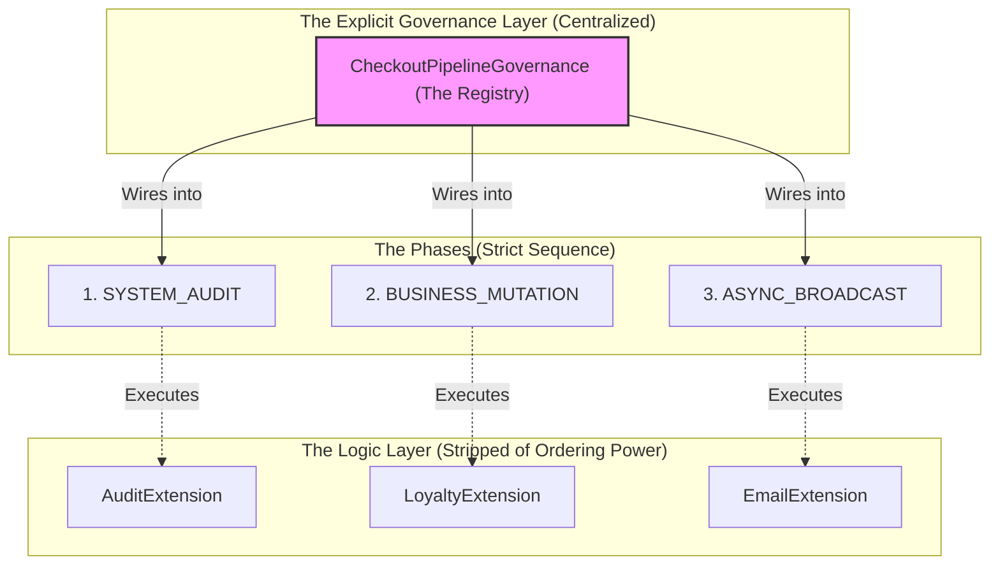

# 🪷 Engineering Brick: Global Governance & The Fallacy of Distributed Ordering

> 🌸 *Năm mươi pháp bảo rải muôn phương,*
> *Tranh nhau thứ tự sinh nhiễu nhương.*
> *Phế bỏ chú pháp đoạt quyền bính,*
> *Quy về một mối định kỷ cương.*

## 🌠 1. The Formal Specification (Problem Model)

Thanks to the **Orthogonal Architecture** established in [Part 2](/posts/3.orthogonal_architecture_extension_layer), our core system is now protected from side-effects. Feature teams can independently build and deploy `PaymentExtensions` (Audit, Loyalty, Notifications, Fraud).

**The Workload & Constraints**:
* **Scale**: The system now runs 50+ extensions across 10 different engineering squads.
* **Temporal Coupling**: Extensions are conceptually orthogonal, but practically sequential. `EmailExtension` *must* run after `AuditExtension` because the email template requires the generated `AuditID`.
* **The Anti-Pattern**: Teams are using Spring's `@Order` annotation to control the execution sequence.
  * Team A writes: `@Order(10) class AuditExtension`
  * Team B writes: `@Order(20) class EmailExtension`

---

## 🌪️ 2. What Breaks First at Scale (The Failure Mode)

Relying on distributed annotations like `@Order` to manage a complex pipeline creates **Global Blindness**. The system does not fail immediately; it rots silently.

1. **The Magic Number Collision**: Team C (Fraud) joins and decides their extension is extremely important. They use `@Order(5)`. Team D (Metrics) uses `@Order(1)`. Eventually, engineers start using `@Order(-9999)` just to guarantee their code runs first.
2. **Invisible Temporal Coupling**: If a junior engineer on Team A refactors `AuditExtension` and changes it to `@Order(30)` because "it looks cleaner," they have no idea they just broke the `EmailExtension` (which is hardcoded to `@Order(20)`). The compiler won't warn them. The IDE won't warn them. It crashes in Production.
3. **Loss of Global Reasoning**: To understand the end-to-end lifecycle of a request, an architect must `Ctrl+Shift+F` the entire codebase for `@Order`, manually write down the numbers, and mentally sort 50 scattered files.

*A Principal Engineer recognizes that Locality of Behavior is great for logic, but catastrophic for execution order.*

---

## 🧩 3. The Architecture: Centralized Static Registry

We must strip individual plugins of their authority to dictate *when* they run. We abolish `@Order` entirely. Instead, we introduce a **Centralized Static Registry** utilizing explicit Pipeline Stages.

### 3.1 The Governance Contract (Invariant)
A pipeline configuration is only correct if it satisfies this invariant:
**The entire Directed Acyclic Graph (DAG) of execution must be explicitly visible, human-readable in a single location, and validated at application startup.**

*Any execution order derived from scattered metadata (annotations) is considered a correctness failure.*

### 3.2 The Code Skeleton
We shift from "Framework Magic" (implicit assembly) to "Explicit Composition."

```java
// 1. The Stage Definition (The Blueprint)
public enum PipelinePhase {
    PRE_VALIDATION,
    SYSTEM_AUDIT,
    BUSINESS_MUTATION,
    ASYNC_BROADCAST
}

// 2. The Stripped Extension (No @Order, No Magic)
@Component
public class AuditExtension implements PaymentExtension {
    // Pure logic. Unaware of its execution order.
    @Override
    public void execute(PaymentContext ctx) { ... }
}

// 3. The Centralized Static Registry (The Single Source of Truth)
@Configuration
public class CheckoutPipelineGovernance {

    // 💠 THE PIVOT INSIGHT: Execution order is explicitly defined in code,
    // making it reviewable in a single Pull Request.
    @Bean
    public ExtensionPipeline checkoutPipeline(
        AuditExtension audit,
        LoyaltyExtension loyalty,
        EmailExtension email
    ) {
        return PipelineBuilder.create()
            .add(PipelinePhase.SYSTEM_AUDIT, audit)
            .add(PipelinePhase.BUSINESS_MUTATION, loyalty)
            .add(PipelinePhase.ASYNC_BROADCAST, email)
            .build();
    }
}
```

### 3.3 Why Not `@DependsOn` or Custom Annotations?
A Senior Engineer looks for a better annotation; a Principal Engineer rejects the annotation paradigm for orchestration.
* **Why not Spring's `@DependsOn`?** It creates a fragile, string-based dependency graph (`@DependsOn("auditExtension")`). Refactoring class names breaks the graph at runtime. It still forces developers to jump between 50 files to understand the flow.
* **Why not a Database-driven Rules Engine?** Storing the pipeline configuration in a database (like PostgreSQL) allows dynamic changes without redeployments. However, it completely bypasses the CI/CD pipeline, Code Review, and Version Control. Changing execution order is a structural change, not a business data change. It belongs in Git.

### 3.4 The Governance Architecture Diagram
*(Note: We use Fullwidth characters `＜` and `＞` in the diagram to ensure perfect rendering).*



---

## ⚙️ 4. Production Realism & Trade-offs

### 🌑 Trap 1: The Monolithic Bottleneck
By moving all configuration to a single `CheckoutPipelineGovernance` class, we have created a Git Merge Conflict hotspot. If 10 teams add plugins simultaneously, they will all modify this same file.
* **The Mitigation:** At extreme scale, we split the registry by `PipelinePhase`. Each Phase gets its own explicit registry file (e.g., `AuditPhaseRegistry`, `BroadcastPhaseRegistry`). The Platform Team governs the ordering of Phases, while Domain leads govern the plugins within their assigned Phase.

### 🌑 Trap 2: Startup Validation Failures
When you explicitly wire a pipeline, you must ensure it is actually valid before accepting production traffic.
* **The Mitigation:** The `PipelineBuilder.build()` method must enforce strict invariants. If a critical phase (like `SYSTEM_AUDIT`) is completely empty, it must throw an `IllegalStateException` and crash the application during the Spring Boot startup sequence (Fail-fast).

### 🧑‍🤝‍🧑 4.3 Organizational Impact
This architecture forces an organizational shift in code ownership:
* **Feature Developers** own the *behavior* of the extensions.
* **Staff/Principal Architects** own the *topology* (the Registry).

If a feature team wants to change *when* their code runs, they must submit a Pull Request to the `CheckoutPipelineGovernance` file. This forces a cross-team architecture review, preventing junior developers from accidentally breaking temporal constraints via hidden annotations.

---

## 🌐 5. Generalization: Code as Infrastructure

What we have built is a localized version of **Infrastructure as Code (IaC)**. We took implicit, distributed settings and turned them into declarative, centralized state.

This pattern is the bedrock of world-class routing and proxy systems:
* **Envoy Proxy / Istio:** Uses explicit filter chains (`FilterChainMatch`) rather than letting filters self-organize.
* **AWS API Gateway:** Execution pipelines (Authorizer $\rightarrow$ Validator $\rightarrow$ Integration) are statically defined.
* **Gradle / Maven Build Lifecycles:** You attach tasks to explicit phases (e.g., `compile`, `test`, `deploy`), you do not give tasks an arbitrary priority integer.

---

🪷 *One sentence to trigger the reflex:* **"Locality of behavior is for logic; global governance is for execution order. Never let a plugin decide when it should run."**

> **Next up**: In our final installment (Part 4), we face the ultimate consequence of a 50-step pipeline. If step 49 fails and we need to retry, the request payload has already been mutated and corrupted by the previous 48 steps. We will explore **The Immutable Pipeline** and how to achieve Zero-Cost State Rollbacks in memory.
```

---

