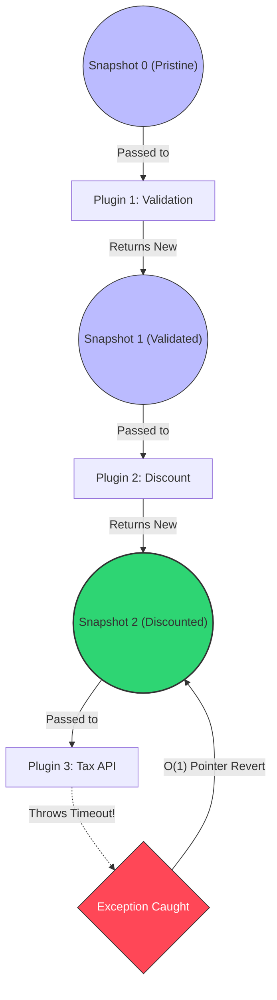

# 🧱 Engineering Brick: The Immutable Pipeline

> 🌸 *A river tainted cannot wash the shore,*
> *A mutated state is pristine no more.*
> *Freeze the context, let the functional reign,*
> *And a fallen step shall leave no stain.*

## 🌠 1. The Formal Specification (Problem Model)

In our previous bricks, we built a massively scalable **Execution Routing Layer** [Part 1](), protected the core via **Orthogonal Extensions** [Part 2](), and explicitly ordered them using a **Centralized Static Registry** [Part 3]().

The system now flawlessly routes a request through a pipeline of 50 distinct stages.

**The Workload & Constraints**:
* **The Payload**: A deeply nested `PaymentContext` object carrying user data, cart items, discounts, and risk scores.
* **The Operation**: Each of the 50 plugins reads the context, makes decisions, and modifies it (e.g., `DiscountPlugin` subtracts $10 from the total).
* **The Anti-Pattern**: The `PaymentContext` is a standard, mutable Java Object (POJO) with Setters. It is passed by reference through the entire pipeline.

---

## 🌪️ 2. What Breaks First at Scale (The Failure Mode)

Mutable state passed through a distributed pipeline is a ticking time bomb for **Temporal Data Corruption**. 

Imagine the request successfully passes through 48 plugins. The `DiscountPlugin` (Step 12) mutated the context by setting `discountApplied = true` and reducing the `finalPrice`. 
Suddenly, Step 49 (`TaxCalculationExtension`) throws a network timeout. 

1. **The Retry Catastrophe**: The orchestration engine catches the timeout and retries the pipeline. Because the `PaymentContext` was mutated, Step 12 sees the object again. If not perfectly coded, it might apply the discount a *second time*. The user is undercharged. The company loses money.
2. **The "Dirty State" Leak**: If the pipeline aborts and writes the failed `PaymentContext` to a Dead Letter Queue (DLQ) for manual inspection, the support engineers are looking at a "dirty" object. It represents a half-finished state that never actually existed in the database. 
3. **Concurrency Panic**: If two async orthogonal extensions try to update the mutable context simultaneously, you get silent race conditions.

*A Principal Engineer recognizes that relying on engineers to manually write "undo" logic for their mutations is mathematically guaranteed to fail.*

---

## 🧩 3. The Architecture: Snapshot-Oriented Execution

We must banish mutable state from the execution flow. We implement the **Zero-Cost Rollback Model**. Plugins do not modify the state; they return a mathematically new version of the state.

### 3.1 The State Correctness Contract (Invariant)
A pipeline execution must be atomic in memory: **Either a stage's mutations are fully accepted, or the state remains mathematically identical to the microsecond before the stage began.** *Any partial mutation retained after a stage failure is a correctness failure.*

### 3.2 The Code Skeleton
We utilize Java `record` (or immutable classes) and treat the pipeline as a Functional Fold (Reduce) operation.

```java
// 1. The Immutable State
public record PaymentContext(
    String transactionId, 
    BigDecimal finalPrice, 
    boolean discountApplied
) {
    // Functional Mutator: Returns a NEW instance, leaving the old one untouched
    public PaymentContext applyDiscount(BigDecimal amount) {
        if (this.discountApplied) return this; 
        return new PaymentContext(this.transactionId, this.finalPrice.subtract(amount), true);
    }
}

// 2. The Functional Extension Contract
public interface PipelineStage {
    // 💠 Notice the signature: It takes a state and returns a NEW state
    PaymentContext execute(PaymentContext currentState);
}

// 3. The Resilient Orchestrator (Zero-Cost Rollback)
@Service
public class ResilientPipelineEngine {
    
    public PaymentContext runPipeline(PaymentContext initialContext, List<PipelineStage> stages) {
        PaymentContext currentState = initialContext;

        for (PipelineStage stage : stages) {
            // 💠 THE PIVOT INSIGHT: O(1) Memory Snapshot. 
            // Because currentState is immutable, copying the reference IS taking a snapshot.
            PaymentContext snapshot = currentState; 
            
            try {
                // The stage attempts to compute a new state
                currentState = stage.execute(currentState);
            } catch (Exception e) {
                // 💠 Zero-Cost Rollback! We simply revert the pointer. 
                // The dirty memory is garbage collected automatically.
                currentState = snapshot; 
                
                log.warn("Stage {} failed. State rolled back.", stage.getClass().getSimpleName());
            }
        }
        return currentState;
    }
}
````

### 🆚 3.3 Alternative Approaches (Design Space)

A Principal Engineer does not just offer a solution; they defend the design space. Why did we choose Snapshot-Oriented Execution?

| Approach | Pros | Cons |
|---|---|---|
| **Mutable + Undo Logic** | Lowest memory allocation | Mathematically impossible to maintain perfectly at scale. |
| **Database `@Transactional`** | Strong persistence consistency | Cannot rollback external 3rd-party API side-effects. Holds DB connections hostage. |
| **Event Sourcing** | Complete chronological audit log | High operational complexity and storage costs. |
| **Snapshot-Oriented (This)** | Deterministic, O(1) in-memory safety | Mild Garbage Collection (GC) overhead. |

👉 *Decision: Immutable pipeline is optimal for the **in-memory orchestration layer**.*

### 3.4 The Functional Flow Diagram

*(Note: Diagram optimized for safe rendering. Text inside edges is strictly quoted).*



-----

## ⚙️ 4. Production Realism & Trade-offs

### 📊 Trap 1: The Garbage Collection (GC) Tax

Creating a new `PaymentContext` object 50 times per request generates high object churn. Is this actually a problem? Let's run a **Back-of-the-envelope (BOTE) Analysis**:

  * **Avg Object Size:** \~200 bytes.
  * **Throughput:** 10,000 RPS × 50 stages = 500,000 objects/sec.
  * **Allocation Rate:** \~100 MB/sec.
  * **JVM Eden Size:** \~2 to 4 GB.

👉 *Result: Minor GC frequency is roughly every 20–40 seconds under steady load.* **Conclusion:** This overhead is perfectly acceptable for most enterprise systems. However, at \>100k RPS (High-Frequency Trading), you must switch strategies (e.g., Copy-on-Write wrappers or Arena allocation).

### 🧭 Trap 2: The Boundary of Truth (System Limits)

Immutability guarantees we can rollback our *Memory*. It does not guarantee we can rollback the *World*.

If Step 48 charged a Credit Card (external API call), and Step 49 fails, rolling back the pointer does not refund the money.

  * Immutability protects **internal state**.
  * It does NOT protect **external side-effects**.

👉 *Therefore: System Correctness = Internal Immutability + External Compensation (Saga Pattern).*

### 🚫 4.3 When NOT to Use This

A pattern applied everywhere is an anti-pattern. Do not use Snapshot-Oriented Execution if:

  * **Ultra low-latency budgets:** Systems requiring sub-10µs latency cannot afford object allocation.
  * **Huge Object Graphs:** If your context is \>10MB (e.g., image processing buffers), deep cloning is lethal.
  * **Pure Streaming:** Stateless pipelines (like Kafka Streams) handle failures differently.

-----

## 🌐 5. Generalization: Immutability as a Scaling Law

This is not a Java trick; it is a universal law of distributed systems:

  * **React / Redux:** UI state is never mutated directly. Reducers return entirely new state trees to guarantee deterministic rendering.
  * **Apache Spark:** RDDs (Resilient Distributed Datasets) are immutable. If a node crashes, Spark simply recomputes the lost partition.
  * **Git:** Commits are immutable snapshots. You don't mutate a commit; you create a new one, making rollback instantaneous.

### 🧠 5.1 What This Demonstrates (The Engineering Signal)

A system designed with Snapshot-Oriented Execution demonstrates:

  * **Deterministic Execution:** The same inputs always yield the same state.
  * **Failure Isolation:** An error in one domain does not corrupt the memory of another.
  * **Stateless Recovery:** Retries are mathematically safe.

*This is the difference between a system that merely works, and a system that survives.*

-----

🪷 *One sentence to trigger the reflex:* **"Principal Engineers don't add complexity — they remove uncertainty from failure."**

> **Next up**: In our final synthesis ([Part 5](https://www.google.com/search?q=/posts/6.capstone_unified_reference_architecture)), we will combine Deterministic Routing, Orthogonality, Global Governance, and Snapshot-Oriented Immutability into a single, production-ready **Reference Architecture**.

