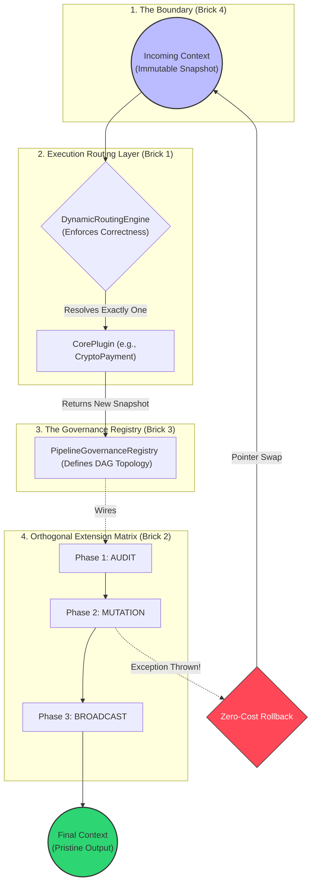

# 🪷 Engineering Brick: The Unified Reference Architecture

> 🌸 *Four pillars raised to hold the sky,*
> *Where routed paths and snapshots lie.*
> *The core is blind, the laws are clear,*
> *The grand design is finally here.*

## 🌠 1. The Formal Specification (The Synthesis Problem)

Over the past four architectural bricks, we have dismantled the monolithic `if-else` chaos and replaced it with strict, scalable laws:
1. **[Part 1] Deterministic Routing:** Banish hardcoded logic; enforce a Correctness Contract.
2. **[Part 2] Orthogonal Extensions:** Separate the Y-Axis (Core) from the X-Axis (Side-effects).
3. **[Part 3] Global Governance:** Destroy `@Order`; centralize the execution topology.
4. **[Part 4] Immutable Pipelines:** Enable Zero-Cost O(1) in-memory rollbacks.

However, in a real Enterprise System, these patterns do not live in isolation. The ultimate challenge of a Principal Engineer is **Composition**—wiring these isolated laws together into a single, high-performance orchestration engine without creating architectural friction.

Today, we build the **Capstone**: The `UnifiedPipelineEngine`.

---

## 🗺️ 2. The Master Blueprint (System of Systems)

Before looking at the code, we must visualize the total execution topology. Notice how the request flows linearly, yet the responsibilities are heavily decoupled.

*(Note: Diagram optimized with Fullwidth characters `＜` and `＞` for safe HTML rendering).*



---

## 🧩 3. The Unified Skeleton (Code as Architecture)

This is the `UnifiedPipelineEngine`. It is the beating heart of our system. Notice that this class contains **zero business logic**. It is purely an infrastructure orchestrator that enforces the four architectural laws.

```java
@Service
@RequiredArgsConstructor
public class UnifiedPipelineEngine {

    // Dependency 1: The Y-Axis (Core Routing - Brick 1)
    private final DynamicRoutingEngine routingEngine;

    // Dependency 2: The X-Axis Topology (Governance - Brick 3)
    private final PipelineGovernanceRegistry registry;

    /**
     * Executes the end-to-end lifecycle of a business transaction.
     */
    public PaymentContext process(PaymentContext initialContext) {

        // 💠 LAW 1: Snapshot-Oriented Memory (Brick 4)
        // Copying the reference creates our O(1) pristine rollback point.
        PaymentContext currentState = initialContext;
        final PaymentContext snapshot = currentState;

        try {
            // 💠 LAW 2: Deterministic Core Execution (Brick 1)
            // The router guarantees exactly one plugin matches, or fails fast.
            ExecutionPlugin corePlugin = routingEngine.resolvePlugin(currentState);

            // The Core acts blindly, returning a mathematically new state
            currentState = corePlugin.execute(currentState);

            // 💠 LAW 3 & 4: Orthogonal Broadcast via Centralized Registry (Bricks 2 & 3)
            // We iterate strictly through the statically defined DAG phases.
            for (PipelinePhase phase : PipelinePhase.values()) {
                List<PaymentExtension> extensions = registry.getExtensionsForPhase(phase);

                for (PaymentExtension ext : extensions) {
                    // Extensions react and fold new immutable states
                    currentState = ext.execute(currentState);
                }
            }

            // The pipeline survived. Return the final accumulated state.
            return currentState;

        } catch (Exception e) {
            // 💠 THE CAPSTONE PIVOT: Instant System-Wide Reversion
            // We caught a fracture. We drop the mutated state and swap the pointer back.
            currentState = snapshot;

            log.error("Pipeline fractured during execution. Memory rolled back to pristine snapshot.", e);

            // Trigger external Saga compensations if necessary, then bubble up the failure.
            throw new SystemFractureException("Transaction aborted cleanly.", e);
        }
    }
}
```

---

## 🧑‍🤝‍🧑 4. Conway's Law: The Organizational Mapping

A Principal Engineer designs systems that map directly to the organizational chart. The `UnifiedPipelineEngine` is not just an execution model; it is an **Organizational Scaling Strategy**.

Here is how a 100-person engineering department interacts with this skeleton without stepping on each other's toes:

| Component | Owned By | Pull Request Rule | Blast Radius if Broken |
| :--- | :--- | :--- | :--- |
| `UnifiedPipelineEngine` | **Platform Architecture** | Requires Chief Architect approval. | System-wide outage. |
| `PipelineGovernanceRegistry` | **Staff Engineers** | Requires cross-domain consensus. | Execution order corruption. |
| `CryptoPaymentPlugin` | **Core Domain Team** | Independent release cycle. | Only Crypto payments fail. |
| `LoyaltyPointsExtension` | **Feature/Growth Team**| Independent release cycle. | Only Loyalty features fail. |

*By physically separating the topology (Registry) from the behavior (Plugins), we eliminate Merge Conflict Hell and prevent junior engineers from accidentally rewriting system physics.*

---

## ⏱️ 5. The Microsecond Lifecycle Walkthrough

To truly grasp the power of this synthesis, let us trace a request through the CPU:

1. **$T_0$ (The Anchor):** A request enters. `PaymentContext` is instantiated. The Engine binds `snapshot = currentState`. Cost: 1 CPU cycle.
2. **$T_1$ (The Verdict):** `DynamicRoutingEngine` evaluates the payload. It strictly rejects ambiguity (enforcing the Correctness Contract) and selects `CryptoPaymentPlugin`.
3. **$T_2$ (The Core Mutation):** `CryptoPaymentPlugin` processes the payment and returns a *new* `PaymentContext` instance with `isPaid = true`.
4. **$T_3$ (The Orthogonal Fold):** The Engine pulls the explicit topology from the `Registry`. It passes the context to `AuditExtension`, then `LoyaltyExtension`. Each returns a new immutable record.
5. **$T_4$ (The Fracture or Victory):** * *If Success:* The accumulated `currentState` is safely persisted or returned.
   * *If Failure:* An exception is thrown. The Catch block executes `currentState = snapshot`. The 3 intermediate objects created in steps 2 and 3 are instantly orphaned and swept away by the Garbage Collector. The system's memory is perfectly restored.

---

## 🌐 6. Conclusion: The Principal Mindset

This Reference Architecture marks the end of our *Mastering Enterprise Complexity* series.

What we have built is a localized reflection of how giant systems—like Kubernetes orchestrators, AWS API Gateways, and financial clearing houses—maintain order in a chaotic world.

**Senior Engineers focus on making the happy path fast.**
**Principal Engineers focus on making the failure path predictable.**

By synthesizing Deterministic Routing, Orthogonal Boundaries, Explicit Governance, and Immutable Snapshots, we did not just write a clever Spring Boot application. We constructed a resilient engine capable of absorbing organizational scaling, temporal failures, and human error without ever corrupting its core truth.

*This is the art of Systems Architecture.*
