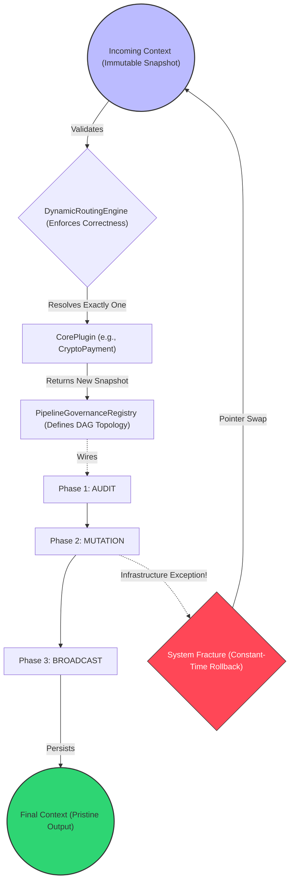

# 🧱 Engineering Brick: The Unified Reference Architecture

> 🌸 *Four pillars raised to hold the sky,*
> *Where routed paths and snapshots lie.*
> *The core is blind, the laws are clear,*
> *The grand design is finally here.*

## 🌠 1. The Formal Specification (The Synthesis Problem)

Over the past four architectural bricks, we have dismantled monolithic `if-else` chaos and replaced it with strict, scalable laws:
1. **[Part 1]() Deterministic Routing:** Banish hardcoded logic; enforce a Correctness Contract.
2. **[Part 2] Orthogonal Extensions:** Separate the Y-Axis (Core) from the X-Axis (Side-effects).
3. **[Part 3] Global Governance:** Destroy distributed magic (`@Order`); centralize the execution topology.
4. **[Part 4] Immutable Pipelines:** Enable constant-time rollback semantics in memory.

However, in a real Enterprise System, these patterns do not live in isolation. The ultimate challenge of a Principal Engineer is **Composition**—wiring these isolated laws together into a single, high-performance orchestration engine without creating architectural friction.

Today, we build the Capstone: The **Deterministic Orchestration Engine**.

---

## 🧭 2. The Three Layers of Truth

Before writing the orchestrator, we must define the boundaries of reality. A resilient system separates failure domains into three distinct layers of truth:

1. **The Memory Layer (Internal State):** Protected by *Snapshot Semantics* and Immutability. This is where our engine operates.
2. **The Persistence Layer (Database):** Protected by *ACID Transactions*.
3. **The External World (Side-effects):** Protected by *Saga Compensations* and Idempotency keys (e.g., calling Stripe or SendGrid).

*👉 A system is correct only when all three layers are aligned. Our engine guarantees the absolute correctness of the Memory Layer, providing a pristine foundation for the other two.*

---

## 🗺️ 3. The Master Blueprint (System of Systems)

Let us visualize the total execution topology. Notice how the request flows linearly, yet the responsibilities are heavily decoupled.

*(Note: Diagram text inside edges is strictly quoted to ensure safe rendering).*



---

## 🧩 4. The Unified Skeleton (Code as Architecture)

This is the `DeterministicOrchestrationEngine`. It contains **zero business logic**. It is purely an infrastructure orchestrator that enforces our architectural laws.

Notice the introduction of the **Observability Hook**. At enterprise scale, you do not debug via breakpoints; you debug via deterministic replay.

```java
@Service
@RequiredArgsConstructor
public class DeterministicOrchestrationEngine {

    // Dependency 1: The Y-Axis (Core Routing - Brick 1)
    private final DynamicRoutingEngine routingEngine;

    // Dependency 2: The X-Axis Topology (Governance - Brick 3)
    private final PipelineGovernanceRegistry registry;

    /**
     * Executes the end-to-end lifecycle of a business transaction.
     */
    public PaymentContext process(PaymentContext initialContext) {

        // 💠 LAW 1: Constant-time Rollback Semantics (Brick 4)
        PaymentContext currentState = initialContext;
        final PaymentContext snapshot = currentState;

        // 🔍 OBSERVABILITY HOOK: Capture initial state hash for deterministic replay
        final String inputHash = currentState.generateStateHash();
        final long startTime = System.nanoTime();

        try {
            // 💠 LAW 2: Deterministic Core Execution (Brick 1)
            ExecutionPlugin corePlugin = routingEngine.resolvePlugin(currentState);
            currentState = corePlugin.execute(currentState);

            // 💠 LAW 3 & 4: Orthogonal Broadcast via Centralized Registry (Bricks 2 & 3)
            for (PipelinePhase phase : PipelinePhase.values()) {
                for (PaymentExtension ext : registry.getExtensionsForPhase(phase)) {
                    currentState = ext.execute(currentState);
                }
            }

            // 🔍 OBSERVABILITY HOOK: Record successful execution
            log.info("Pipeline completed. InputHash: [{}], OutputHash: [{}], Latency: {}ms",
                     inputHash, currentState.generateStateHash(), (System.nanoTime() - startTime) / 1_000_000);

            return currentState;

        } catch (BusinessValidationException be) {
            // A Business Bug (e.g., Insufficient Funds) is normal. We halt and inform the user.
            log.warn("Business validation failed for InputHash: [{}]", inputHash);
            throw be;

        } catch (Exception e) {
            // 💠 THE PIVOT: System Fracture Detection
            // A "System Fracture" is not a business failure, but a violation of execution guarantees
            // (e.g., DB timeout, OOM, or infrastructure fault).

            currentState = snapshot; // Constant-time rollback

            log.error("System Fracture detected. Memory rolled back to pristine snapshot [{}].", inputHash, e);
            throw new SystemFractureException("Execution guarantees violated. Transaction halted.", e);
        }
    }
}
```

---

## 🧑‍🤝‍🧑 5. Conway's Law: The Organizational Mapping

A Principal Engineer designs systems that map directly to the organizational chart. This engine is not just an execution model; it is an **Organizational Scaling Strategy**.

Here is how a 100-person engineering department interacts with this skeleton:

| Component | Owned By | Pull Request Rule | Blast Radius if Broken |
| :--- | :--- | :--- | :--- |
| `DeterministicOrchestrationEngine` | **Platform Architecture** | Requires Chief Architect approval. | System-wide outage. |
| `PipelineGovernanceRegistry` | **Staff Engineers** | Requires cross-domain consensus. | Execution order corruption. |
| `CryptoPaymentPlugin` | **Core Domain Team** | Independent release cycle. | Only Crypto payments fail. |
| `LoyaltyPointsExtension` | **Feature/Growth Team**| Independent release cycle. | Only Loyalty features fail. |

*By physically separating the topology (Registry) from the behavior (Plugins), we eliminate Merge Conflict Hell and prevent junior engineers from accidentally rewriting system physics.*

---

## ⚖️ 6. When This Architecture Is Overkill

A pattern applied blindly is an anti-pattern. This architecture is designed for Tier-1, highly concurrent, multi-team environments. You should **NOT** use this if you have:
* **Small services** (<5 engineers contributing to the repository).
* **Low-risk workflows** (No financial data, no critical state).
* **Stateless request-response systems** (Simple CRUD applications).

*In such systems, simpler mutable pipelines or basic Service classes are entirely sufficient.*

---

## 🧠 7. Conclusion: What This Architecture Demonstrates

This Reference Architecture marks the end of our *Mastering Enterprise Complexity* series. A system built on these principles natively demonstrates:
* **Deterministic execution under failure:** Inputs strictly dictate outputs, even when infrastructure crashes.
* **Isolation of side-effects:** Orthogonal extensions cannot secretly corrupt the core.
* **Organizational scalability via clear ownership boundaries:** Teams scale without stepping on each other's toes.

👉 *This is the difference between a system that merely works, and a system that can be absolutely trusted.*

**Architecture is not about building features — it is about defining what must never break.**
