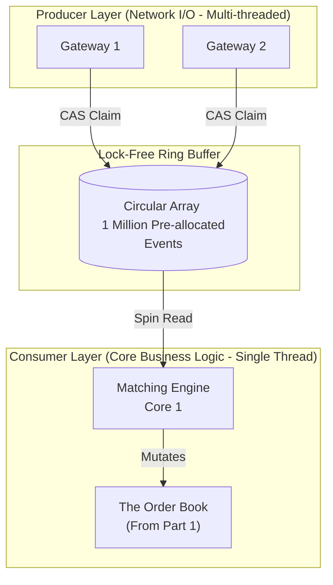

# 🧱 Engineering Brick: The Single-Threaded Engine

> 🌸 *A thousand threads will tangle, lock, and wait,*
> *One single core flows freely through the gate.*

Welcome back to the Stock Exchange Core series. In [Part 1](/posts/2.stock_exchange_order_book), we designed an $O(1)$ memory-aligned Order Book. But a static data structure is useless without an engine to drive it. Today, we build the **Heart**: The Matching Engine.

## 🌠 1. The Formal Specification (Problem Model)
The Matching Engine is the brain of the exchange. It receives incoming orders, matches them against the resting Order Book, and emits trade executions.

**The Interface (Core Operations)**:
* `process(Order)`: Intake an order from the network layer.
* `execute(Trade)`: Output a matched trade to the clearing and market data downstream.

**The Workload & Constraints**:
* **Throughput**: 100,000+ operations per second.
* **Latency**: $< 50 \mu s$ per match.
* **Determinism**: 100% reproducible state. If we replay the exact same orders in the exact same sequence, the exact same trades must be generated.
* **Correctness**: Zero race conditions. Double-matching (overselling) is a catastrophic financial failure.

The challenge: How do we ingest millions of requests from thousands of concurrent network connections into a single engine without melting the CPU?

---

## ⚡ 2. The Design Dialogue (Socratic Review)

*I simulate a design review with a Senior Engineer (The Challenger) to break down the concurrency myth.*

> **🕵️ The Challenger**: We have servers with 64 cores. Let's use a massive Thread Pool. Multiple threads can process incoming orders concurrently to maximize throughput.

**🧑‍💻 The Architect**:
Concurrent matching leads to **Race Conditions**. Suppose Thread A and Thread B both receive a BUY order for 100 shares of AAPL at the exact same microsecond. The Order Book only has one resting SELL order for 100 shares. If both threads read the book simultaneously, they will both execute the trade. We just sold 200 shares when only 100 existed.

> **🕵️ The Challenger**: That is a basic synchronization issue. We just wrap the Order Book in a `Mutex` or a `ReadWriteLock`.

**🧑‍💻 The Architect**:
In High-Frequency Trading (HFT), a Mutex is poison. When a thread hits a locked Mutex, the Operating System steps in, suspends the thread, and puts it to sleep (**Context Switching**). A single context switch takes roughly $3 \mu s$ to $5 \mu s$ and flushes the CPU's L1/L2 cache. At 100k TPS, the system will spend 90% of its time managing locks and waking up threads, destroying our latency budget.

> **🕵️ The Challenger**: So if locks are too slow, what is the alternative? Lock-free concurrent queues?

**🧑‍💻 The Architect**:
Even lock-free queues (using Compare-And-Swap) suffer from heavy **Lock Contention** at the CPU bus level. The only way to achieve deterministic, ultra-low latency is to process the core business logic using exactly **One Single Thread**. We trade *Concurrency* for pure, uninterrupted *Sequential Speed*.

---

## 🧩 3. The Architecture: The LMAX Disruptor Pattern
If the Matching Engine is strictly single-threaded, how do multiple network threads safely hand data to it? We discard traditional Queues and use a **Ring Buffer** (inspired by the LMAX Disruptor).

A Ring Buffer is a pre-allocated, fixed-size circular array. Producers (Network Threads) claim slots and write data. The Consumer (Matching Engine) chases them, reading data.

```cpp
// 1. The Ring Buffer Event (Pre-allocated, padded to Cache Line)
struct DisruptorEvent {
    Order order;
    char padding[...]; // Padded to 64 bytes
};

// 2. Sequence Counters (Atomic, Lock-free)
// Alignas(64) prevents False Sharing between Producer and Consumer cores.
alignas(64) std::atomic<int64_t> producerCursor{-1};
alignas(64) std::atomic<int64_t> consumerCursor{-1};

// 3. The Pre-allocated Circular Array
class RingBuffer {
    DisruptorEvent entries[1048576]; // 1 Million pre-allocated slots (Power of 2)

    // Producers use CAS (Compare-And-Swap) to claim the next sequence
    // Consumer spins (while loop) waiting for sequence to be published
};

```

### The Lock-Free Flow Diagram



---

## 🔄 4. Lifecycle Walkthrough (The Lock-Free Trace)

Let's trace how an order flows without a single OS lock.

**T0: Network Gateway 1 receives Order A.**

1. Gateway 1 calls `producerCursor.fetch_add(1)`. It instantly claims `Sequence 42`.
2. Gateway 1 writes Order A's details into `entries[42]`.
3. Gateway 1 publishes a separate `commitSequence` to signal the data is ready.

**T1: The Matching Engine (The Consumer)**

1. The Engine is sitting in a tight `while` loop (Spinning), constantly checking if `Sequence 42` is committed.
2. It sees the commit. It reads `entries[42]`.
3. Because the Engine is the **only thread** mutating the Order Book, it processes the match immediately. No locks, no mutexes, no waiting.

---

## 📊 5. Concurrency Cost Matrix

Why go through the trouble of building a Ring Buffer instead of using `std::queue`? The numbers speak for themselves:

| Synchronization Method | Latency Cost (approx) | OS Intervention? |
| --- | --- | --- |
| Mutex / Lock | $10,000+$ CPU Cycles | Yes (Context Switch) |
| CAS (Compare-And-Swap) | $100 - 300$ CPU Cycles | No (Hardware level) |
| Uncontended Spin Read | $2 - 5$ CPU Cycles | No |

By using the Ring Buffer, the Matching Engine reads data at the speed of L1 Cache ($~2$ CPU cycles), completely bypassing the Operating System scheduler.

---

## ⚙️ 6. Production Realism: CPU Pinning

Single-threaded logic is only fast if it actually stays on the CPU.
If the Operating System decides to pause our Matching Engine thread to run a background antivirus update, we experience a latency spike of several milliseconds.

**The Fix (Thread Affinity / CPU Pinning)**:
In production Linux systems, we isolate specific CPU cores.

* Cores 0-2: Assigned to the OS, Network Interrupts, and Logging.
* **Core 3: Dedicated EXCLUSIVELY to the Matching Engine.**
We use the `taskset` command or `pthread_setaffinity_np` to bind our thread to Core 3. The OS scheduler is forbidden from assigning any other process to this core. The core runs at 100% utilization, constantly spinning, waiting for the Ring Buffer.

---

## 💎 7. Deep Dive: Mechanical Sympathy & False Sharing

*If you are building for a Tier-1 HFT firm, you must understand how the CPU physically moves memory.*

Look at the sequence counters in our code: `producerCursor` and `consumerCursor`. If we don't use `alignas(64)`, the compiler might place these two 8-byte integers next to each other in RAM.
When the CPU pulls data into its 64-byte L1 Cache Line, it pulls **both** cursors.

* Core A (Producer) updates `producerCursor`. This invalidates the entire 64-byte cache line.
* Core B (Consumer) is reading `consumerCursor`. Even though Core B doesn't care about `producerCursor`, its cache is flushed because they share the same physical line. Core B must fetch from main RAM again.

This "Cache Line Bouncing" destroys performance. By adding `alignas(64)`, we force the compiler to place the cursors on entirely separate memory blocks. They never share a cache line. This principle is called **Mechanical Sympathy**—designing software that works in harmony with the underlying hardware.

---

## 🌐 8. The Staff-Level Scale: Engine Sharding (Macro View)

*Wait, if the entire Matching Engine runs on a single thread on Core 3, how does the exchange scale to handle thousands of different stock symbols (AAPL, TSLA, NVDA)?*

The elegant answer is **Determinism allows Sharding without cross-talk**.
A trade on AAPL has absolutely no impact on the Order Book of TSLA. Therefore, we do not need a single monolithic engine. We **Shard by Symbol**.

* **Engine 1 (Core 3)**: Handles AAPL, MSFT, GOOG.
* **Engine 2 (Core 4)**: Handles TSLA, NVDA.

By partitioning the workload using a hash of the instrument ID, we can scale out horizontally across multiple cores and multiple servers, while keeping each individual engine strictly single-threaded and lock-free.

---

### 🗝 The "Brick" Summary (Mental Model)

* **🌠 Signal**: Ultra-low latency requirements combined with complex state mutations.
* **🧩 Structure**: Multi-Producer, Single-Consumer (MPSC) Ring Buffer (LMAX Disruptor).
* **🏛 Invariant**: Only one thread is permitted to mutate the core state (Order Book).
* **💠 Pivot Insight**: Multi-threading is for I/O bounds. Single-threading is for CPU bounds. To go fast, eliminate locks, eliminate context switching, and pin the thread to the metal.

---

🪷 *One sentence to trigger the reflex*: **"Lock the thread to the core, ditch the mutex for the ring, let the single engine roar."**

> **Next up**: In [Part 3](posts/4.stock_exchange_architecture), we will explore the network boundaries. How do we achieve **Global Order** and **Disaster Recovery** if our single-threaded engine crashes? We will explore Event Sourcing, the Sequencer pattern, and Write-Ahead Logs (WAL).
